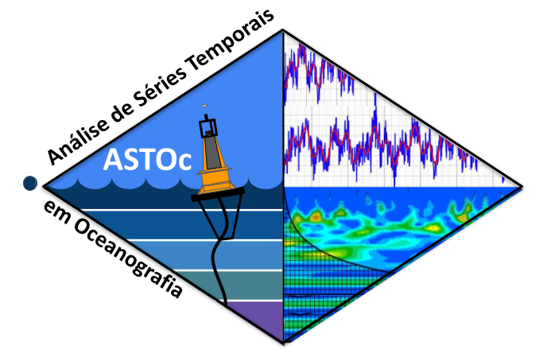

# ASTOc

Este é o repositório da 
🌊 **Escola de Verão ReNOMO - Curso de Análise de Séries Temporais em Oceanografia** 📈 
 

Aqui compartilhamos os notebooks de python que foram trabalhados durante o curso, incluindo:
- Introdução à análise espectral 🌀
- Aplicações de modelos autoregressivos para previsão de séries temporais 📊
- Análise de wavelets para identificação de padrões e eventos em séries temporais 🌊🔍
- Introdução à análise de componentes principais (PCA) para redução de dimensionalidade e identificação de padrões 📉
- Uso de diversas bibliotecas Python para manipulação e visualização de dados 🐍📊

Embora todas as soluções aqui foram construidas com bibliotecas e pacotes públicos, considere citar a propriedade intelectual das soluções apresentadas no curso com o DOI  acima. 

Primeira turma - de 25 de Fevereiro à 01 de Março de 2024: 

Foi um prazer imenso conhecer e trabalhar com todos vocês em Fortaleza neste verão! 🌞🌊📈
